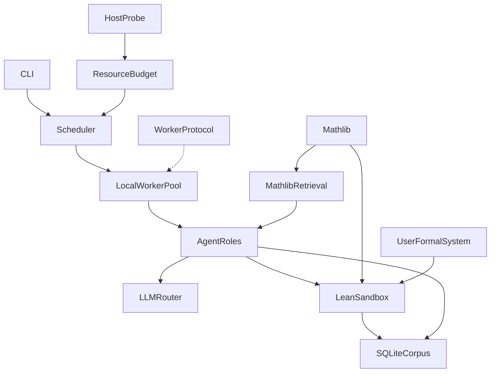

# Local AI Mathematician

Leibniz’s three pieces, mapped onto one Windows-local program:

- **Language:** Lean 4. A statement is a theorem only when `lean` accepts it with no `sorry` / `admit`.
- **Library:** Mathlib is primary. `aimath init` creates a Lake project that `require`s `leanprover-community` / `mathlib` and downloads the build cache (`lake exe cache get`). Proofs and exploration search Mathlib first and import its modules. The SQLite corpus stores only this system's own conjectures and theorems. arXiv abstracts stay optional and untrusted; they never count as proofs.
- **Reasoner:** LLM agents. Backends are all provisioned: any OpenAI-compatible endpoint (OpenAI, Groq, OpenRouter, Ollama, LM Studio, vLLM) and Anthropic.

“Thousands or millions of agents” is a **queue of tasks**, not millions of live model processes. Physical workers stay inside a non-invasive host budget (leave one CPU core and a memory reserve). The same work message a local worker runs is what a future remote worker would run.

Invented axioms are a **formal system**, not new truths of ordinary mathematics. Theorems inside them are stored as “relative to system S”.

## Architecture

## Layout

New Python package `aimath` (Python 3.11+), no existing code in the repo:

- [`pyproject.toml`](pyproject.toml) — deps: `httpx`, `psutil`, `pyyaml`; CLI entry `aimath`
- [`config.example.yaml`](config.example.yaml) — model provider, Lean path, headroom, Mathlib toolchain, optional arXiv
- [`src/aimath/cli.py`](src/aimath/cli.py) — `init`, `resources`, `prove`, `explore`, `system`, `status`
- [`src/aimath/host/probe.py`](src/aimath/host/probe.py) — CPU count, RAM, load via `psutil`; Windows priority stays at or below normal
- [`src/aimath/host/budget.py`](src/aimath/host/budget.py) — RAM reserve (default 25%) and shrink if available memory falls. Lean workers are capped by both free cores (`cores - 1`) and a per-worker Mathlib footprint (default about 3 GB), so a full import cannot swap the machine. Separate smaller cap for in-flight LLM calls.
- [`src/aimath/runtime/protocol.py`](src/aimath/runtime/protocol.py) — JSON work item / result (`prove`, `conjecture`, `check`, `critique`, `formalize`)
- [`src/aimath/runtime/scheduler.py`](src/aimath/runtime/scheduler.py) — backlog queue drained by a process pool (Lean, CPU) and a thread pool (LLM, network)
- [`src/aimath/llm/router.py`](src/aimath/llm/router.py) — `openai_compatible` and `anthropic` adapters; provider, `base_url`, model, and API-key env var from config
- [`src/aimath/lean/sandbox.py`](src/aimath/lean/sandbox.py) — write a temp Lean file in the Mathlib workspace, run `lake env lean` with a timeout, reject `sorry` and `admit`. Each file imports the Mathlib modules the retriever names, and falls back to `import Mathlib` when no narrower module is known
- [`templates/lean_project/`](templates/lean_project/) — `lean-toolchain` pinned to Mathlib's toolchain, `lakefile.toml` with `require mathlib` from `leanprover-community`. `aimath init` runs `lake update` and `lake exe cache get`
- [`src/aimath/knowledge/corpus.py`](src/aimath/knowledge/corpus.py) — SQLite of this system's systems, statements, attempts, and proofs (content hash). Mathlib itself is not copied into SQLite
- [`src/aimath/knowledge/retrieve.py`](src/aimath/knowledge/retrieve.py) — search order is Mathlib declarations under `.lake/packages/mathlib` (name and module path), then the local corpus, then arXiv abstracts if enabled (marked untrusted)
- [`src/aimath/agents/personalities.py`](src/aimath/agents/personalities.py) — styles (curious generalist, elementary, structural, formula-driven, cross-field), each a prompt bias
- [`src/aimath/agents/loop.py`](src/aimath/agents/loop.py) — conjecture, prove, critique, record
- [`src/aimath/formal/system.py`](src/aimath/formal/system.py) — load a user YAML system (name, notation notes, axioms as Lean strings) into a Lean namespace that still imports Mathlib. User axioms extend Mathlib; they do not replace it
- [`tests/`](tests/) — budget math (including the Mathlib memory cap), protocol round-trip, sorry-rejection parsing, YAML-to-Lean snapshot with a Mathlib import. A live Mathlib check is skipped unless `lean_ws` has already been initialized, so unit tests do not download Mathlib

## Runs

**`aimath init`** writes `./aimath.yaml` and `./lean_ws/`, then fetches Mathlib and its cache. `prove` and `explore` refuse to start until that workspace is ready. If `elan` / `lake` is missing, init stops with install instructions rather than running an unverified mode.

**`aimath prove --statement "..."`** places the goal in the Mathlib project, checks that it type-checks, then agents propose tactic proofs until the budget or a success. Success is stored only with the Lean output. A hit already declared in Mathlib is reported as a known lemma, not a new theorem.

**`aimath explore --domain nat --personality curious --steps N`** looks up related Mathlib modules first, then generates candidates. It drops duplicates of Mathlib declarations and of the local corpus, drops trivial goals (`True`), tries proofs against those imports, and keeps failures as open conjectures.

**`aimath system load file.yaml`** installs a user theory on top of Mathlib. A formalist step may also *propose* a small system; it is labeled proposed until it type-checks against Mathlib, and its theorems stay scoped to that system.

Personalities change what gets proposed. They do not bypass Lean.

## Limits (stated in the README)

- Novelty means “not already a Mathlib declaration and not already in this system's corpus”. It does not mean unknown to all of mathematics.
- Mathlib text is the trusted library. arXiv text is a hint. Only a kernel-accepted proof with no `sorry` / `admit` is stored as a theorem.
- The first init downloads a large Mathlib cache (many GB, network required). Checks that fall back to `import Mathlib` are slow; the budget keeps concurrency low because of that.
- Worker count tracks this machine. The protocol file documents the remote worker shape; no network cluster is started.

## Not in this build (against the original request)

The original request was a mathematician that finds new truths, using Lean, a library of all mathematics, an LLM reasoner, a huge agent prover, host-aware use of the machine, and concurrent, parallel, and distributed runs, plus new formal systems, user systems, curiosity, and personalities drawn from many fields. This plan is the local core chosen earlier. The items below are still outside it.

- **New mathematical truths.** The loop can store a Lean-checked theorem that is new to this corpus. It has no literature search beyond Mathlib names, no open-problem list, and no standard for claiming a result is new to mathematics.
- **A knowledge repository of all mathematics.** Mathlib is the primary library. Other internet sources are only an optional arXiv-abstract fetch. Missing: papers in full, encyclopedias, OEIS, textbooks, notes “recorded elsewhere”, and libraries from other provers (Isabelle, Coq, Metamath).
- **A theorem prover at prover scale.** One conjecture-then-tactic loop is included. Missing: proof search (best-first, Aesop-style, hammers), premise selection over Mathlib, learning from failed attempts, and a solver path distinct from proving (closed forms, equations, computation).
- **Thousands or millions of agents.** The backlog can hold many tasks. Live work is capped by this machine’s CPU and RAM. There is no swarm of concurrent model agents.
- **Coming up with new equations and systems.** Exploration emits Lean candidates, and one formalist step can propose a small axiom set on top of Mathlib. Missing: a research program that invents definitions, notations, and theories on its own, and keeps the ones that prove useful.
- **Optimal, non-invasive use of the host.** Included: a CPU and RAM snapshot, a reserve, below-normal priority, and a Mathlib memory cap. Missing: GPU, disk, thermals, and network latency; measuring which of Lean or the model is the bottleneck; and moving work toward whichever backend is faster right now.
- **Concurrent, parallel, and distributed.** Local process and thread pools cover one machine. The worker message is specified for a later remote worker. Missing: a real multi-machine runtime, shared queue, and failure handling across nodes. (That was deferred when the first build was set to a local core.)
- **Curious, nerd, and other mathematicians.** A few prompt styles bias proposals (curious, elementary, structural, formula-driven, cross-field). Missing: an ongoing curiosity drive that picks its own questions when idle, a richer “nerd” mode, named working styles that can collaborate or switch mid-proof, and inspiration that actually pulls from widely different fields rather than one cross-field prompt.
- **Proofs, results, and truths as a body of work.** SQLite stores attempts and accepted proofs. Missing: a readable write-up, export (Lean project, PDF, or paper-like note), and a review step that ranks results for a person to read.
